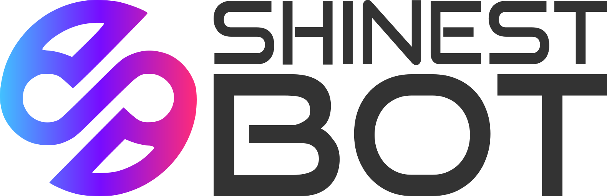

<p align="left">
  <a href="https://nestjs.com">
    
  </a>
  <a href="https://www.mongodb.com">
    
  </a>
</p>

<p align="center">
  
</p>

## Installation

### Local:
```bash
npm i
```

### Access to google spreadsheets
Put file `credentials.json` in the root folder
File must contains json credentials for GoogleSpreadsheet API service account

### Inside container:
```bash
docker-compose build
```

## Launch

### Regular local launch
```bash
nest start
```

### Development local launch
```bash
$ docker-compose up -d mongodb
$ npm run start:dev
```

### Lounch with ontainer build
```bash
docker-compose up -d --build
```

### Container logs (last 50 lines of logs)
```bash
docker-compose logs --tail 50
```

## Test spreadsheet
[Google spreadsheet](https://docs.google.com/spreadsheets/d/1YLjE5g7Xa6GiV3F0q7Q6jFMZbFbOULrppV338E7_wiA/)

## Nest cli tips

```sh
nest g resource core/users --no-spec
```

## License

Shinest Bot is licensed under the terms of the [MIT license](LICENSE.md). Please see the [LICENSE](LICENSE.md) file for full details.